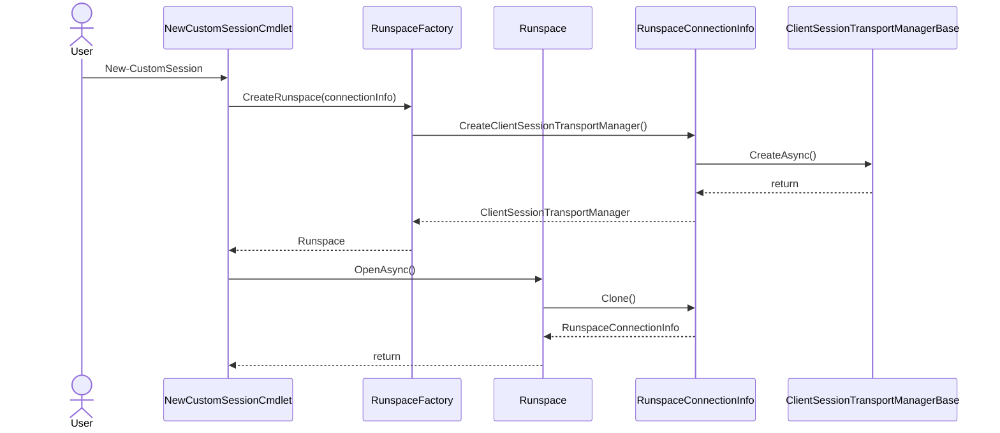

# PoshAnywhere

This module provides multiple additional transport mechanisms for PowerShell remoting.

This is an implementation of the [Custom Transport Feature Introduced in PowerShell 7.3](https://github.com/PowerShell/PowerShell/pull/17011) using the [Named Pipe Connection Custom Transport Example](https://github.com/PaulHigin/NamedPipeConnection) as a reference.

## Custom Transport Flow

