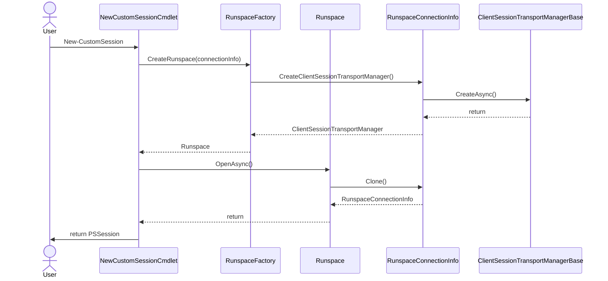

# PoshAnywhere

This module provides multiple additional transport mechanisms for PowerShell remoting. These implementations are primarily focused on providing:

- A "phone home" server that has no dependencies other than a PowerShell script that can be easily bootstrapped into an environment.
- A client that can connect and ideally discover these servers.

This is an implementation of the [Custom Transport Feature Introduced in PowerShell 7.3](https://github.com/PowerShell/PowerShell/pull/17011) using the [Named Pipe Connection Custom Transport Example](https://github.com/PaulHigin/NamedPipeConnection) as a reference.

## PSRemoting Transport Basic Architecture

PSRP effectively is a protocol that occurs by exchanging XML-encoded single line messages across a in/out pipe. This is known as an `OutOfProc` transport, which differs from the classic `WSMan` based transport. The transport layer handles how those messages get from the client to the server and vice versa. You don't really need to know much more about PSRP to build a transport layer other than it is sending single-line xml messages back and forth, much in the same way you don't need to understand the content of an HTTPS request to move that data back and forth via TCP.

By focusing on the concepts of streams and pipes the primary transport abstraction for PSRP, we can then use any technology that supports streams/pipes for I/O. This allows for a broad level of potential implementations, such as:

- Stdin/Stdout of processes
- SSH (the current implementation basically uses a subsystem to pipe the stdin/out XML messages between the server and client)
- Named Pipes
- TCP Sockets
- HTTP/HTTPS stream transports like Websockets
- SignalR
- Azure Queues/Event Grid
- Apache Kafka
- Websocket or Port Forwarding Rendesvous Services such as NGrok, Cloudflare Tunnels, or Azure Relay
- Adding custom authentication such as Azure OAuth2 or MFA

## Client Side Implementation

The core implementation of a PSRemoting Transport for the client is creating a class derived from the `RunspaceConnectionInfo` abstract class which generally defines the state of the runspace and initializes required components, and a transport implementation derived from the `ClientSessionTransportManagerBase` abstract class that actually does the heavy lifting of moving messages back and forth. Once the remote runspace is established by using `CreateRunspace` and supplying the `RunspaceConnectionInfo`, a PSSession is just a further wrapper around the runspace that allows invoke-command, enter-pssession, etc. to interact with it just like any other runspace session.

While functional, the runspace alone is not very user friendly, so you usually will also want to make a `New-MyCustomTransportSession` or `Connect-MyCustomTransport` cmdlet to simplify the process of:

1. Discovering or specifying the server. For instance, have autocomplete for a list of available servers in a domain or list of available servers registered to a relay.
1. Establishing the Runspace Using the Connection Info
1. Opening the runspace, connecting to the server, and then creating and returning a PSSession.

For the NamedPipeConnection example, the "server" already exists, so the client is just wiring up to that client. For the AttachProcess example, as long as the initialized process accepts and responds to PSRP messages

Note that this implementation part is almost exclusively focused on the **client** side.

### Anatomy of a New Remoting Session Cmdlet

## Server Side Implementation

On the server side, there is no explicit implementation, your Transport Manager simply needs to interact with whatever PowerShell process exists on the other side and pass the messages. Every PowerShell 5.1+ process has an associated named pipe for PSRP as an IPC transport, so this naturally is an easy entrypoint. The name of the pipe is a consistent derivation of the process ID and its start time that can be predicted, but it can also be explicitly named by starting PowerShell with the `-CustomPipeName` parameter. PowerShell also has an undocumented `-Server` parameter that allows the stdin/stdout of the process to be used as the channels for PSRP, which can be useful if you want to spawn a new process and not work within an existing process.

Most servers will be some form of wiring up to these in/out channels (either named pipe or stdin/stdout) in such a way that the transport manager can reach them. For instance, the TCP/IP example, the server simply connects the named pipe to a TCP socket, and the client connects to that socket, so that the PSRP messages can flow back and forth as needed. No knowledge about the actual content of the messages is needed other than the fact that they are line-delimited to indicate the end of a message.

## Alternative Server Implementations

Even though it is called the PowerShell Remoting Protocol, it is in fact designed to be agnostic of PowerShell and is a general RPC framework. You could even have a PSRP remote that isn't even a PowerShell session. For instance, [there is an implementation of PSRP](https://psrpcore.readthedocs.io/en/latest/) in Python, so theoretically you could remote PowerShell from Python or send commands from PowerShell to a Python-hosted service.
